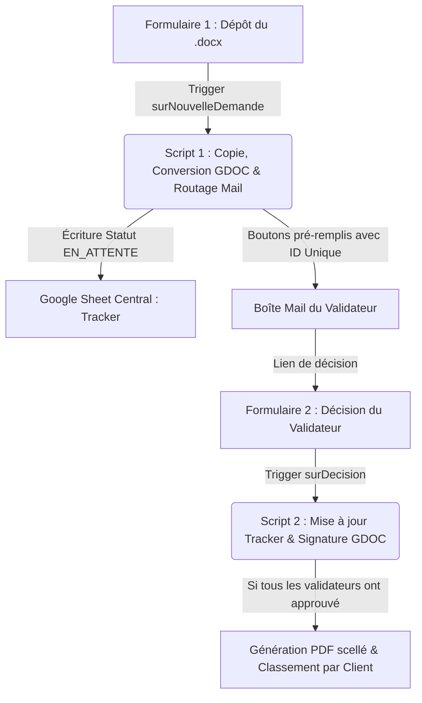

# Documentation Technique — Flux d'Approbation des Fiches Produits Méthodes

Ce projet automatise et sécurise la validation collective des fiches méthodes de production (TB Groupe) avant leur intégration finale dans l'ERP Sylob.

---

## 1. Vision et Objectifs Métier (Pour un Junior)

L'objectif de cette automatisation est d'éradiquer les goulots d'étranglement administratifs tout en garantissant une traçabilité d'audit stricte. Elle résout trois problèmes majeurs :
* **La Perte d'Information** : Les validations par e-mails informels ou via des conversations orales sont remplacées par des transactions signées, traçables et figées dans le marbre.
* **La Dépendance Temporelle** : Les validateurs reçoivent des formulaires pré-remplis à la volée. Plus besoin de chercher quel document valider ni de modifier manuellement le tableau de suivi.
* **L'Intégrité Documentaire** : La signature n'est pas une simple image copiée/collée, mais une ligne insérée dynamiquement dans le tableau du document natif, couplée à un identifiant unique (scellement), le tout converti en PDF inaltérable.

---

## 2. Architecture et Flux de Données

Le système fonctionne comme un "Sas de Validation" asynchrone réparti sur deux phases :

### Phase 1 : Le Dépôt (script1_depot.js)
1. **Interception** : À la soumission du Formulaire 1, le script récupère les métadonnées (Référence, Révision, Client, Fichier source `.docx` et liste des processus à valider).
2. **Nomenclature** : Il renomme le fichier d'origine selon la norme usine : `FOR-PRO-[Ref]_REV[Rev]`.
3. **Conversion invisible** : Afin de modifier programmatiquement le document, le script convertit le `.docx` d'origine en Google Doc de travail temporaire via l'API Drive v3.
4. **Routage intelligent** : Il recherche les adresses e-mails associées aux processus dans l'onglet de configuration `Config_Signataires`.
5. **Scellement initial** : Pour chaque processus et chaque validateur, il génère un ID unique de signature (`SIG-AAAAMMJJ-XXXX`) et insère une ligne en statut `EN_ATTENTE` dans l'onglet `Tracker`.
6. **Notification** : Il expédie un e-mail unique au validateur contenant un bouton d'action pré-rempli avec les paramètres d'approbation (Formulaire 2).

### Phase 2 : La Décision (script2_decision.js)
1. **Traitement du vote** : À la soumission du Formulaire 2, le script extrait l'ID unique de signature reçu.
2. **Validation dans le Tracker** : Il cherche la ligne correspondante dans le `Tracker` et passe son statut à `APPROUVÉ` (ou `REFUSÉ` avec motif envoyé au déposant).
3. **Signature dans le Document** : Il ouvre le Google Doc de travail, repère le tableau d'historique (identifié par la cellule `PROCESSUS*`), cherche la ligne du processus concerné, et y écrit la signature (E-mail + Date + ID Unique). Il ajoute également un bandeau visuel de scellement en fin de document.
4. **Scellement final (PDF)** : Si tous les validateurs assignés à la fiche ont approuvé, le script exporte le Google Doc en PDF, crée un dossier au nom du Client dans le répertoire `03 - Fiches Validées`, y range le PDF finalisé et notifie le déposant.

---

## 3. Structure du Google Sheet Central (`Validation_Fiche_Produit`)

* **`Config_Signataires`** : Table de correspondance entre le processus usine (ex: `USINAGE`) et les adresses e-mails des validateurs (séparées par des virgules).
* **`Tracker`** : Journal d'audit centralisant l'historique complet des validations, les liens vers les documents de travail et les identifiants de signature uniques.
* **`Utilisateurs`** : Table de lookup pour résoudre le nom complet des collaborateurs depuis leur adresse e-mail.
* **`Logs`** : Journal de diagnostic technique pour la maintenance et la résolution d'anomalies en production.

---

## 4. Maintenance et Diagnostics (Pourquoi le script échoue ?)

* **Erreur `Drive is not defined`** : Le service Avancé **Drive API** (v3) n'a pas été activé dans le menu "Services" de l'éditeur Apps Script de la feuille de réponses.
* **Erreur `Tableau HISTORIQUE DES RÉVISIONS introuvable`** : Le tableau de signature du fichier Word importé ne contient pas `PROCESSUS*` ou `HISTORIQUE` dans sa première cellule (en haut à gauche). Le script utilise cette cellule comme point d'ancrage pour cibler le tableau.
* **Problème de décalage de colonnes** : Si des questions sont ajoutées ou déplacées dans les formulaires, vérifiez l'onglet `Logs` pour voir la ligne `[DIAGNOSTIC] Valeurs brutes reçues`. Ajustez alors les index dans la constante `FORM1` ou `FORM2` des scripts.
* **L'email de validation ne part pas** : Le validateur n'est pas ou est mal configuré dans l'onglet `Config_Signataires`, ou le processus soumis ne correspond pas exactement (attention à la casse et aux espaces).
