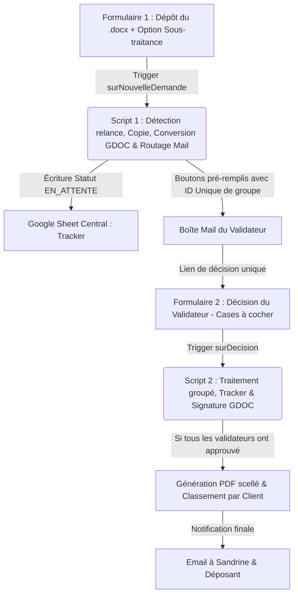

# Documentation Technique — Flux d'Approbation des Fiches Produits Méthodes

Ce projet automatise et sécurise la validation collective des fiches méthodes de production (TB Groupe) avant leur intégration finale dans l'ERP Sylob.

---

## 1. Vision et Objectifs Métier (Pour un Junior)

L'objectif de cette automatisation est d'éradiquer les goulots d'étranglement administratifs tout en garantissant une traçabilité d'audit stricte. Elle résout trois problèmes majeurs :
* **La Perte d'Information** : Les validations par e-mails informels ou via des conversations orales sont remplacées par des transactions signées, traçables et figées dans le marbre.
* **La Dépendance Temporelle et Ergonomie** : Les validateurs reçoivent un formulaire pré-rempli unique par document regroupant l'ensemble des processus sous leur responsabilité. Plus besoin de soumettre plusieurs formulaires.
* **L'Intégrité Documentaire** : La signature n'est pas une simple image copiée/collée, mais une ligne insérée dynamiquement dans le tableau du document natif (page 2), couplée à un identifiant unique (scellement), le tout converti en PDF inaltérable. Le bandeau de signature en fin de document a été supprimé à la demande du métier pour ne pas surcharger le livrable.

---

## 2. Architecture et Flux de Données

Le système fonctionne comme un "Sas de Validation" asynchrone réparti sur deux phases :

### Phase 1 : Le Dépôt (script1_depot.js)
1. **Interception** : À la soumission du Formulaire 1, le script récupère les métadonnées (Référence, Révision, Client, Fichier source `.docx`, liste des processus à valider, et l'option "Sous-traitance").
2. **Nomenclature** : Il renomme le fichier d'origine selon la norme usine : `FOR-PRO-[Ref]_REV[Rev]`.
3. **Cas de Sous-traitance** : Si l'option sous-traitance est cochée à "Oui", le script force Alex (`a.devaux@tb-groupe.fr`) comme signataire unique pour tous les processus sélectionnés.
4. **Relance ciblée et ré-injection** : 
   - Si la révision a déjà été soumise et possède des lignes dans le tracker (resoumission suite à un refus), le script met à jour l'ID du Google doc de travail sur toutes les lignes.
   - Les signatures des validateurs ayant déjà approuvé sur la version précédente sont automatiquement ré-injectées dans le nouveau Google Doc.
   - Seuls les processus qui ont été refusés (ou qui sont nouveaux) sont repassés à `EN_ATTENTE` et font l'objet d'une nouvelle demande de signature.
5. **Routage groupé** : Pour chaque validateur concerné, le script génère un ID unique de signature (`SIG-AAAAMMJJ-XXXX`) partagé pour tous ses processus à valider lors de cette soumission.
6. **Notification** : Il expédie un e-mail unique au validateur avec un lien d'action pré-remplissant toutes ses cases à "J'approuve".

### Phase 2 : La Décision (script2_decision.js)
1. **Traitement groupé** : À la soumission du Formulaire 2, le script extrait l'ID unique de signature de groupe.
2. **Interprétation des cases à cocher** : Le script extrait la liste des processus approuvés et refusés.
3. **Mise à jour en masse** : Toutes les lignes du tracker correspondant à cet ID de signature sont traitées :
   - Processus approuvés : Passage à `APPROUVÉ` et écriture de la signature dans le Google Doc (Page 2, tableau d'historique).
   - Processus refusés : Passage à `REFUSÉ` et envoi instantané d'un email de refus avec motif au déposant.
4. **Notification Sandrine & Fin de flux** : Si tous les processus du document sont validés (`APPROUVÉ` ou `ANNULÉ`), le Google Doc est converti en PDF, classé dans le dossier du Client (sous "03 - Fiches Validées"), et un email de validation finale est envoyé au déposant ainsi qu'à Sandrine (`s.guillemin@tb-groupe.fr`).

---

## 3. Structure du Google Sheet Central (`Validation_Fiche_Produit`)

* **`Config_Signataires`** : Table de correspondance entre le processus usine (ex: `USINAGE`) et les adresses e-mails des validateurs (séparées par des virgules).
* **`Tracker`** : Journal d'audit centralisant l'historique complet des validations, les liens vers les documents de travail et les identifiants de signature uniques.
* **`Utilisateurs`** : Table de lookup pour résoudre le nom complet des collaborateurs depuis leur adresse e-mail.
* **`Logs`** : Journal de diagnostic technique pour la maintenance et la résolution d'anomalies en production.

---

## 4. Maintenance et Diagnostics (Pourquoi le script échoue ?)

* **Erreur `Drive is not defined`** : Le service Avancé **Drive API** (v3) n'a pas été activé dans le menu "Services" de l'éditeur Apps Script de la feuille de réponses.
* **Erreur `Tableau HISTORIQUE DES RÉVISIONS introuvable`** : Le tableau de signature du fichier Word importé ne contient pas `PROCESSUS*` ou `HISTORIQUE` dans sa première cellule (en haut à gauche). Le script utilise cette cellule comme point d'ancrage pour cibler le tableau.
* **Problème de décalage de colonnes (Formulaire 2)** :
  Le Formulaire 2 doit être configuré avec les colonnes suivantes :
  - Colonne B : Votre adresse email (Email validateur)
  - Colonne C : Identifiant de signature (`ENTRY_SIGNATURE_ID`)
  - Colonne D : Processus approuvé(s) (Cases à cocher, `ENTRY_APPROUVES`)
  - Colonne E : Processus refusé(s) (Cases à cocher, `ENTRY_REFUSES`)
  - Colonne F : Motif du refus (Texte de paragraphe, `ENTRY_MOTIF`)
  Ajustez les index dans les scripts s'ils diffèrent de la configuration.
* **L'email de validation ne part pas** : Le validateur n'est pas ou est mal configuré dans l'onglet `Config_Signataires`, ou le processus soumis ne correspond pas exactement (attention à la casse et aux espaces).

